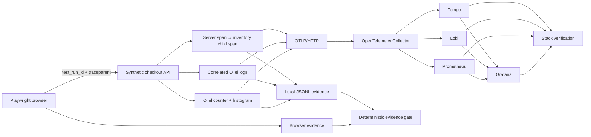

# Quality Observability Lab

[](https://github.com/javicale/quality-observability-lab/actions/workflows/quality.yml)

**From “the test failed” to evidence explaining where and why.**

A local, synthetic **R&D / learning lab** that connects Playwright browser tests with OpenTelemetry traces, correlated logs, metrics, deterministic evidence, OTLP ingestion and a local Grafana LGTM stack. It is a portfolio experiment, not a production observability platform and not a release approval system.

## What it demonstrates

- A browser checkout with a healthy path and an intentionally injected inventory error (HTTP 500).
- A unique `test_run_id` per scenario and W3C `traceparent` propagated from the browser to the backend.
- Real OpenTelemetry server/child spans, exception events, correlated log records, a request counter and a duration histogram.
- Dual telemetry paths: inspectable local JSON/JSONL evidence and OTLP/HTTP export.
- A local `grafana/otel-lgtm` stack exposing Grafana, Tempo, Loki and Prometheus on loopback only.
- Programmatic stack verification proving that the expected traces, correlated logs, metrics and Grafana dashboard are queryable.
- Playwright screenshot, video, trace and HTML report evidence.
- A deterministic evidence gate with negative tests that fail closed when relationships or signals are missing.
- GitHub Actions validating both the deterministic evidence contract and the real local OTLP/LGTM contract without repository secrets or external SaaS accounts.

## Run locally

Prerequisites: Node.js 24 LTS and npm. For the visual stack experiment, Docker with Compose is also required.

### Deterministic evidence mode

```sh
git clone https://github.com/javicale/quality-observability-lab.git
cd quality-observability-lab
npm ci
npx playwright install chromium
npm test
npm run report
```

On Linux, install browser system packages with `npx playwright install --with-deps chromium` when needed. `npm test` checks JavaScript syntax, runs gate unit tests, starts a fresh local app, runs both browser scenarios and validates the file-based telemetry evidence. Port 3000 must be available.

### OTLP + Grafana LGTM mode

```sh
npm run stack:up
npm run demo:stack
npm run stack:down
```

`demo:stack` waits for the local stack, runs the same synthetic checkout with `file+otlp` telemetry, then verifies Grafana, Tempo, Loki and Prometheus through their local APIs. The compose ports are bound to `127.0.0.1` only. Grafana is available at `http://127.0.0.1:3001` while the stack is running.

## Understanding green CI with a deliberate failure

| Scenario | HTTP | Business assertion | Lab expectation |
|---|---:|---|---|
| Healthy checkout | 200 | PASS | Must pass |
| Injected inventory failure | 500 | FAIL | Must fail at the final checkout assertion; all preceding correlation checks must pass |

The failing scenario is narrowly marked as an expected Playwright failure **after** setup and correlation assertions. CI is green only when both outcomes are observed and the evidence gate passes. There are no retries, skipped tests or `continue-on-error`. A missing 500, broken healthy checkout or missing telemetry fails the experiment.

To see the same failure as a normal red test:

```sh
node scripts/run-lab.js --raw-failure
```

The business failure remains `FAIL` in the evidence even when the experiment gate is `PASS`. Neither outcome authorizes a real release.

## Evidence to inspect

`artifacts/latest.json` points to the current unique run directory:

```text
artifacts/<execution-id>/
  success.json              # browser outcome, run ID, trace ID, screenshot path
  error.json                # deliberate business FAIL + response
  traces.jsonl              # exported OTel server/child spans and exception
  logs.jsonl                # OTel logs with traceId + spanId + test.run_id
  metrics.jsonl             # cumulative request counter and duration histogram
  quality-gate.json         # deterministic experiment verdict
  stack-verification.json   # present in stack mode; verified backend ingestion/query results
playwright-report/          # HTML report and attachments
test-results/               # browser traces, screenshots and videos
```

GitHub Actions uploads file-mode evidence as `quality-observability-evidence` and stack-mode evidence as `quality-observability-stack-evidence`, each retained for 14 days.

## Architecture



File-based evidence remains the deterministic, directly inspectable contract. Stack mode adds an independent integration contract proving that the same application telemetry is accepted over OTLP and queryable from the local observability backends. Metric correlation is intentionally bounded at scenario/status level; run/trace correlation is exact for spans, logs and browser evidence.

## Documentation

- [Architecture and decisions](docs/ARCHITECTURE.md)
- [Signals, correlation and evidence contract](docs/OBSERVABILITY.md)
- [Five-minute demo and troubleshooting](docs/DEMO.md)
- [Learning guide and findings](docs/LEARNING.md)
- [Final verified results](docs/RESULTS.md)
- [Phase 2 stack design](docs/PHASE2-STACK.md)
- [Security and scope](SECURITY.md)

## Portfolio context

This lab extends the evidence and CI themes in [Playwright Quality Engineering](https://github.com/javicale/playwright-quality-engineering), complements [Quality Engineering Playbook](https://github.com/javicale/quality-engineering-playbook), and keeps the explicit experimental boundaries of [Agentic Quality Engineering](https://github.com/javicale/agentic-quality-engineering). Its focus is deterministic failure diagnosis and telemetry correlation; no AI agent is required for this experiment.

## Boundaries

Single synthetic service process, serial Chromium scenarios, manual instrumentation, in-memory inventory operation and synchronous evidence flushes. The LGTM stack is local and ephemeral; there is no real database, payment system, load benchmark, distributed deployment, long-term telemetry retention, flakiness analysis, production SLO, authentication model or production security hardening. Grafana anonymous access is enabled only for the loopback-bound demo stack. The browser supplies a valid remote parent context; a browser OTel root span is not exported.

Author: Javier Capa. License: ISC.
