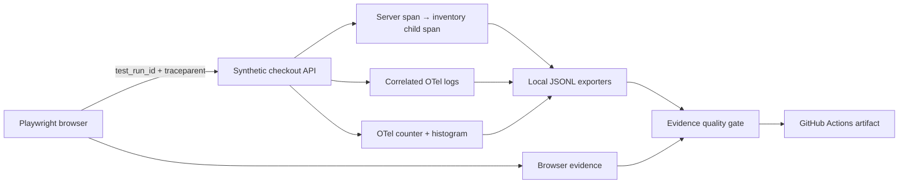

# Quality Observability Lab

[](https://github.com/javicale/quality-observability-lab/actions/workflows/quality.yml)

**From “the test failed” to evidence explaining where and why.**

A local, synthetic **R&D / learning lab** connecting Playwright browser tests with OpenTelemetry backend traces, correlated logs, metrics and failure evidence. This is a portfolio experiment, not a production-ready observability platform or release approval system.

## What it demonstrates

- A browser checkout with a healthy path and an intentionally injected inventory error (HTTP 500).
- A unique `test_run_id` per scenario and W3C `traceparent` sent from the browser to the backend.
- Real OpenTelemetry SDK server/child spans, an exception event, correlated log records, a request counter and duration histogram.
- JSON/JSONL evidence, browser screenshots, video, Playwright trace and HTML report.
- A deterministic quality gate that rejects broken correlation or missing signals; negative tests prove the gate can fail.
- GitHub Actions on push and pull request, without repository secrets or external services.

## Run locally

Prerequisite: Node.js 24 LTS and npm. Windows PowerShell, Linux and macOS use the same commands.

```sh
git clone https://github.com/javicale/quality-observability-lab.git
cd quality-observability-lab
npm ci
npx playwright install chromium
npm test
npm run report
```

On Linux, install browser system packages with `npx playwright install --with-deps chromium` when needed. `npm test` checks JavaScript syntax, runs gate unit tests, starts a fresh local app, runs both browser scenarios and validates the telemetry evidence. Port 3000 must be available. No Docker, account, API key or cloud telemetry service is required.

## Understanding green CI with a deliberate failure

| Scenario | HTTP | Business assertion | Lab expectation |
|---|---:|---|---|
| Healthy checkout | 200 | PASS | Must pass |
| Injected inventory failure | 500 | FAIL | Must fail at the final checkout assertion; all preceding correlation checks must pass |

The failing scenario is narrowly marked as an expected Playwright failure **after** setup and correlation assertions. CI is green only when both outcomes are observed and the evidence gate passes. There are no retries, skipped tests or `continue-on-error`. A missing 500, broken healthy checkout or missing telemetry fails the experiment.

To see the same failure as a normal red test (intentional nonzero exit):

```sh
node scripts/run-lab.js --raw-failure
```

The business failure remains `FAIL` in the evidence even when the experiment gate is `PASS`. Neither outcome authorizes a real release.

## Evidence to inspect

`artifacts/latest.json` points to the current unique run directory:

```text
artifacts/<execution-id>/
  success.json          # browser outcome, run ID, trace ID, screenshot path
  error.json            # deliberate business FAIL + response
  traces.jsonl          # exported OTel server/child spans and exception
  logs.jsonl            # OTel log records with traceId + spanId + test.run_id
  metrics.jsonl         # cumulative request counter and duration histogram
  quality-gate.json     # deterministic experiment verdict
playwright-report/      # HTML report and attachments
test-results/           # browser traces, screenshots and videos
```

CI uploads these directories as `quality-observability-evidence` for 14 days, including on failure. Generated evidence is excluded from Git. Absolute screenshot paths describe the original runner; downloaded artifacts retain the `test-results/` files for local inspection.

## Architecture



The file exporters intentionally make the telemetry inspectable without a collector. They export from actual SDK records; they are not an OTLP collector, Jaeger or Grafana deployment. Metric correlation is at scenario/status level; run/trace correlation is exact for spans, logs and browser evidence.

## Documentation

- [Architecture and decisions](docs/ARCHITECTURE.md)
- [Signals, correlation and evidence contract](docs/OBSERVABILITY.md)
- [Five-minute demo and troubleshooting](docs/DEMO.md)
- [Learning guide, findings and roadmap](docs/LEARNING.md)
- [Security and scope](SECURITY.md)

## Portfolio context

This lab extends the evidence and CI themes in [Playwright Quality Engineering](https://github.com/javicale/playwright-quality-engineering), complements [Quality Engineering Playbook](https://github.com/javicale/quality-engineering-playbook), and keeps the explicit experimental boundaries of [Agentic Quality Engineering](https://github.com/javicale/agentic-quality-engineering). It focuses on deterministic failure diagnosis; no AI agent is needed for this experiment.

## Boundaries

Single process, serial Chromium scenarios, manual instrumentation, synthetic in-memory inventory operation, local files and synchronous evidence flushes. There is no real database, payment, load benchmark, distributed deployment, long-term telemetry storage, flakiness analysis, production SLO or security hardening. The browser supplies a valid remote parent context; a browser OTel root span is not exported. Future collector/OTLP integration must be separately implemented and verified.

Author: Javier Capa. License: ISC.
